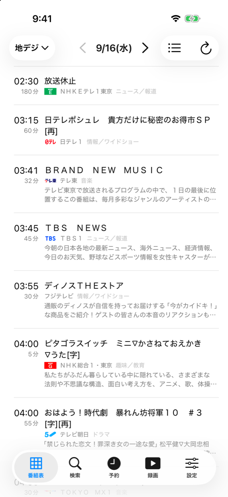
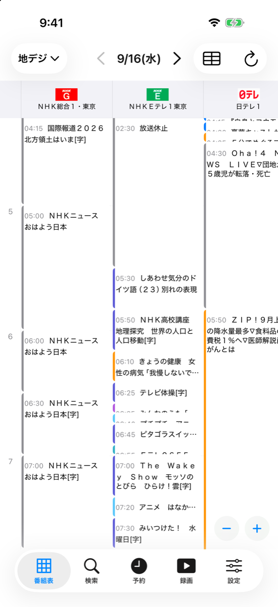
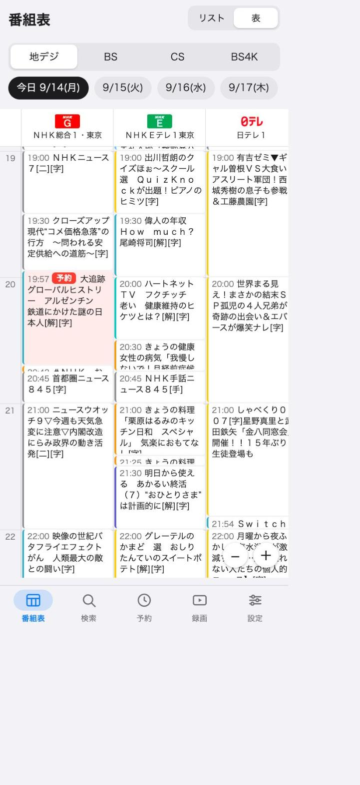

# bdzbridge

Sony BDZ（Blu-ray レコーダー）用の番組表・録画予約ブリッジです。2027 年 3 月に終了する Video & TV SideView の代わりに、スマホから番組表を見て予約し、録画を整理するために作りました。レコーダー自身が受信した 8 日分の番組表と、レコーダーの UPnP 予約サービスを使います。インターネット上のサービスには依存しません。

Sony 非公式のソフトウェアです。レコーダーが LAN 内に公開している機能を相互運用のために利用しているだけで、映像・音声の保護（DTCP-IP）には触れていません。

使い方は 2 通りあります。**iOS アプリ**はレコーダーと直接話し、番組表を端末内に持つので外出先でも読めます。**サーバー + PWA** はブラウザから使えて、キーワード自動予約のように常時動くものを担います。どちらか片方だけでも成り立ちます。

## 画面

| iOS アプリ（番組表・リスト） | iOS アプリ（番組表・表） | PWA（番組表・表） |
|---|---|---|
|  |  |  |

表モードは横にチャンネル、縦に時間で、ピンチで時間軸を伸縮できます。番組表のデータと局ロゴはレコーダーが受信したもので、このリポジトリには含まれていません。ロゴを持たない局は名前だけで表示します（レコーダー自身の画面もそうなります）。

## 構成

```
app/      iOS アプリ（Swift / SwiftUI）      ─┐
                                              ├─ どちらもレコーダーの :64220 と :60151 を直接使う
server/   FastAPI サーバー ── web/  PWA      ─┘
docs/     レコーダーの仕様（観察に基づく）と移植ガイド
```

- `app/` — iOS アプリ。`app/RecorderKit` がレコーダーと話す層（プロトコル、番組表ファイルのデコーダ、HTTP クライアント、端末内キャッシュ）で、UI を持たず単体でテストできます。`app/BDBridge` が画面。Xcode プロジェクトは `app/project.yml` から XcodeGen で生成し、コミットしていません。詳しくは `app/README.md`。
- `server/` — FastAPI サーバー（`bdzbridge` パッケージ）。API と PWA の配信、番組表のキャッシュ、レコーダー探索、キーワード自動予約。
- `web/` — Vite + Svelte 5 の PWA。`/api/v1` を同一オリジンで使います。
- `docs/` — 予約 API（`xsrs-api.md`）と番組表ファイル形式（`epg-format.md`）の仕様、レコーダーが実際に何を答えるかの実測（`upnp/service-sweep.md`）、HTTP API リファレンス（`api.md`）、移植ガイド（`porting.md`）と言語非依存の検証ベクタ（`port/`）。

どちらの実装も同じ観察に基づいていて、`docs/port/` のベクタで突き合わせています。移植を考える人はそこから読むのが早いはずです。

## 使い方

### iOS アプリ

手順とコマンドは `app/README.md` にあります。Apple は無料の Apple アカウントでも
[実機テストができる](https://developer.apple.com/support/compare-memberships/)としています（デバイス 3 台、
1 台につきアプリ 3 つ、プロファイルは 7 日で失効）。このアプリはエンタイトルメントを必要としないので無料の
アカウントでも署名できる見込みですが、**開発に使っているのは有料メンバーシップで、無料での確認はしていません。**

```
brew install xcodegen
cd app && xcodegen generate && open BDBridge.xcodeproj
```

予約タブの右上からレコーダー本体の「おまかせ・まる録」（キーワード自動録画）を登録・削除できます。レコーダー自身が
番組を探して録るので、アプリもサーバーも動いていなくて構いません。対象チャンネルの絞り込みだけは本体でしか設定できません。

初回は起動時のセットアップ画面で「レコーダーを探す」を押して選びます（このときだけレコーダーの電源が入っている必要があります）。つながると番組表を自動で取得し、以後は夜中にバックグラウンドで取り直すので、朝には 8 日分が最新の状態になります。レコーダーが LAN から消えていれば Wake-on-LAN で起こしてからつなぎます。

### サーバーと PWA

```
cd server
uv sync --group dev
cp .env.example .env        # BDZBRIDGE_API_TOKEN を設定
uv run python -m bdzbridge  # http://127.0.0.1:8000/ （LAN に出すなら BDZBRIDGE_BIND_HOST=0.0.0.0）
```

予約画面の「レコーダーのおまかせ・まる録」からも同じ条件を本体に登録できます。サーバー側の「自動予約」（番組表の
更新のたびにこちらで予約を入れるもの）とは別で、本体に登録したものはサーバーが止まっていても働きます。

初回はブラウザでトークンを入力し、LAN 内のレコーダーを探索して選びます。選択は保存され、DHCP で IP が変わっても追従します。PWA を更新するときは `web/` で `npm install && npm run build` してサーバーを再起動します。外出先から使うなら Tailscale などの VPN 越しにしてください。

動作確認機種: BDZ-FBT4100（2021 年モデル）。他の機種は `description.xml` の `EPG_CAP` が `01` であれば番組表も取れる見込みですが未確認です。

## 再生について

録画番組をスマホで観る機能はありません。録画番組の配信は DTCP-IP の保護下にあり、本ソフトは扱いません。レコーダー自身が申告している配信形式もほぼすべて DTCP-IP 付きです（`docs/upnp/connectionmanager-answers.txt`）。

録画タブの「テレビで再生」はレコーダー自身に再生させる機能で、レコーダーにつながったテレビに映ります（レコーダーの電源が入ります）。一時停止・再開・停止もできます。

録画一覧にサムネイルは出しません。レコーダーが返す画像は全タイトル共通のダミー画像でした。

## 注意

- レコーダーの API は無認証です。このサーバーを LAN の外に直接公開しないでください。
- 予約の作成・変更・削除は実機に反映されます。

## ライセンス

MIT License。`LICENSE` を参照してください。
